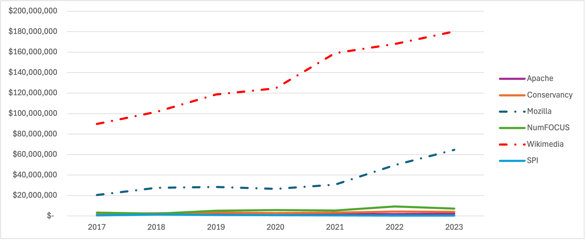
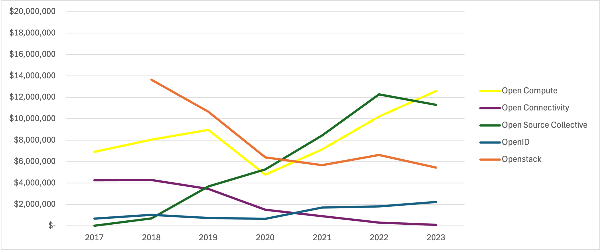

layout: true
name: fullheader
background-image: url(../apachecon/img/neonbrand-258972-unsplash-sm.jpg)
background-size: cover

---
layout: true
name: contributions
background-image: url(../apachecon/img/rawpixel-600782-unsplash-sm.jpg)
background-size: cover

---
layout: true
name: thanks
background-image: url(../client/img/stuart-guest-smith-150560-169.jpg)
background-size: cover

---
layout: true
name: fosdem
background-image: url(../fossbackstage/img/KaraSowles-FOSDEM2024-Slide6.png)
background-size: cover

---
layout: true
name: logorb
class: left
background-image: url(img/ComCodeLogo.png)
background-repeat: no-repeat
background-position: bottom .8rem right 5rem
background-size: 10%

---
template: fullheader
# *Coming up next*

# Who Funds FOSS Foundations?
# Shane Curcuru - 2025

---
template: fullheader
name: start
# Who Funds FOSS Foundations?
## Modeling Open Source Foundation Finances

### [@ShaneCurcuru](https://twitter.com/shanecurcuru)
### [FOSSSustainability.com/ComCode](https://fosssustainability.com/comcode)

---
template: logorb
# Resources

All data and resources are in these open source projects!

## [FOSSSustainability.com/ComCode](https://fosssustainability.com/comcode)
## [FOSSFoundation.info](https://fossfoundation.info/)

*I expect to see PRs this week!*

.bottomnote[license: Apache-2.0]

???
Please follow along at fosssustainability.com/comcode for links to slides
and all the data and code associated with this project!

---
template: logorb
name: topics
# Topics

- Aspects of Sustainability
- Modeling Foundation Sponsorships
- Financial Data of Key Foundations (US)

???
Topics for today...
**SPACEBAR**

--
- *Finding better questions to ask*

???
I hope to leave everyone with enough information and ideas, so that you can start asking better questions when you're working on sustainability.
Note: this is US centric data; would love help collating non-US nonprofit data.

---
template: fullheader
name: aspects
# Aspects of Sustainability

---
template: logorb
# Aspects of Sustainability

.left-column-equal[
**Who**

- Users
- Contributors
- Maintainers
- PMC / TSC
]
.right-column-equal[
**What**
- Software Companies
- Non-Software Companies
- Educational Institutions
- Governments
- Standards Bodies
]

.bottomnote[https://fosssustainability.com/aspects/]

???
Listening sustainability conversations, I'm struck by how siloed they are.  Each participant is coming in with their own needs and their own vocabulary, and it's often hard to find efficient ways to translate one aspect's needs to the vocabulary or taxonomy some other aspect needs.

---
template: logorb
# Aspects of Sustainability

.left-column-equal[
**Who**

- Users
- Contributors
- **[Maintainers](https://fosssustainability.com/aspects/maintainer?s=ss)**
- PMC / TSC
]
.right-column-equal[
**What**
- **[Software Companies](https://fosssustainability.com/aspects/software-company?s=ss)**
- Non-Software Companies
- Educational Institutions
- Governments
- Standards Bodies
]

.bottomnote[https://fosssustainability.com/aspects/]

???
TODO: story about policy bodies working on sustainability - but maintainers simply asking how do they get paid?

---
template: logorb
# Aspects of Sustainability

.left-column-equal[
**Who**

- Users
- **[Contributors](https://fosssustainability.com/aspects/contributor?s=ss)**
- Maintainers
- PMC / TSC
]
.right-column-equal[
**What**
- Software Companies
- Non-Software Companies
- **[Educational Institutions](https://fosssustainability.com/aspects/education?s=ss)**
- Governments
- Standards Bodies
]

.bottomnote[https://fosssustainability.com/aspects/]

???
TODO: software companies that still have good OSPOs or FOSS Funds are doing great! But a new contributor asks: how can I make a living off that if maintainers aren't doing it?  You're only funding your specific dependencies, not open source in general.

---
template: fullheader
# Aspects of Sustainability

> How do we translate between these groups?

.bottomnote[https://fosssustainability.com/aspects/]

---
template: fullheader
name: sponsorship
# Sponsorship Program Modeling

> How do foundations define their sponsorship programs?

> How can we model these programs to gain insight?

???
In researching how foundations are funded, I wanted to see how much income was directly from official sponsorship models, and how those sponsorship models were structured and marketed.  What kinds of benefits do sponsors get, and how much does it cost?

So I built a model and analyzed 30+ foundations or sub-foundations to see the data.  More to come!

---
template: logorb
# Sponsorship Program Criteria

- Only publicly posted programs
- Not tracking event sponsorships
- Level amounts are approximate
- Tracking ~30 foundations so far

.bottomnote[https://fossfoundation.info/sponsorships]

???
I'm focusing on quantifying how traditional foundation corporate sponsorships are modeled.  All data is drawn from publicly posted sponsorship programs in the past year or so.  This is not including event sponsorships, because those have a different typical structure, and aren't expected to be continuing.

**IMPORTANT:** Numbers are approximate! A number of programs offer sliding scales by numbers of employees or revenue; we track the top end of each level's cost.  Also, we don't know the actual details of sponsorships; some may pay more or less depending on discounts or other factors.

Model schema explainer: https://fossfoundation.info/sponsorships#sponsorship-model-structure

---
template: logorb
# Sponsorship Program Schema

- Map program levels to *first, second,..., community, etc.*
- Track funding **amount** per level
- Model the **benefits** for levels
  - *Governance* /or/ *Advisory* roles
  - Services or Events discounts
  - Marketing partnerships
- Scrape live CSS or landscape.yml

.bottomnote[https://github.com/Punderthings/fossfoundation/blob/main/_data/sponsorships-schema.json]

???
Most organizations include scraping definitions to automatically parse listings of sponsorship pages; some are manually drawn maps as of a specific date.  Future ideas include using the wayback machine to see historical sponsorship trends, both of foundations, and of sponsors.

Model schema explainer: https://fossfoundation.info/sponsorships#sponsorship-model-structure

---
template: logorb
# Sponsorship Program Dataset

.left-column-equal-vsm[
- Adélie Linux
- Arch Linux
- ArduPilot
- Apache Software Foundation
- Academy Software Foundation
- CD Foundation
- Cloud Native Computing Foundation
- Debian
- Drupal
- FINOS Foundation
- FreeBSD
- Free Software Foundation Europe
- Gentoo
- Gnome
- GraphQL Foundation
- Haskell
- Hyperledger
- JS Foundation
]
.right-column-equal-vsm[
- Linux Foundation
- LF AI Foundation
- LF Energy Foundation
- LLVM Foundation
- NumFOCUS
- Open Mainframe Foundation
- Open SSF Foundation
- Open Stack Foundation
- OSGEO
- Open Source Initiative
- OWASP
- Plone
- PostgreSQL
- Python
- Rails Foundation
- Raspberry Pi NA
- Software Freedom Conservancy
- Software in the Public Interest
]

.bottomnote[https://fossfoundation.info/sponsorships]

???
**IMPORTANT:** this is only a subset of foundations, mostly depending on which foundations fit the criteria and were easiest to write scrapers for - or had a small enough sponsor list I could manually hardcode it.  This does not represent the whole ecosystem.

---
template: logorb
# Sponsorships - Apache

.left-column-equal[
**Funding Sponsors**
- First: **8** *Platinum*
- Second: **11** *Gold*
- Third: **7** *Silver*
- Fourth: **12** *Bronze*
]
.right-column-equal[
**In-Kind Sponsors**
- First: **13**
- Second: **5**
- Third: **2**
- Fourth: **10**
]

.bottomnote[book values (USD): Cash ~1.8M, In-Kind: 2M]

???
These calculations are done by multiplying the number of listed sponsors at each level, times the "price" of that sponsorship level in the prospectus.

We can see a good mix of sponsor levels; we also see the ASF has more in-kind donations overall than cash ones.

---
template: logorb
# Sponsorships - Apache

.left-column-equal-sm[
**First Level Cash Sponsors**
- Apple
- Amazon + *In-Kind*
- Facebook
- Google
- Huawei
- Microsoft + *In-Kind*
- Pineapple Fund
- Yahoo + *In-Kind*
]
.right-column-equal-sm[
**First Level In-Kind Sponsors**
- Cloudbees
- DLAPiper
- Gradle
- Leaseweb
- jFrog
- OSUOSL
- Sonatype
- JetBrains
- Fastly
- GitHub
- Yahoo!
- JFrog
]

???

Here's **who** sponsors the ASF at the highest level.  I have data files on who sponsors all the foundations tracked in the model online at FOSSFoundation.info, showing which companies like sponsoring only at the top level, for example.

---
template: logorb
# Sponsorships - NumFOCUS

.left-column-equal[
**Funding Sponsors**
- First: **6** *Principal*
- Second: **7** *Sustaining*
- Third: **3** *Contributing*
]
.right-column-equal[
**Other Sponsors**
- Community: **5**
- Startups: **1**
- *Grants:* **3**
]

.bottomnote[book values (USD): Cash ~1M; grants ?]

???
NumFOCUS has a smaller set of projects and a different focus, but otherwise is a c3 like the ASF that provides various project services.  Here we see a notably smaller number of sponsoring organizations.  Note the actual 1M value there is likely off, because their grant programs aren't assigned specific values.  Anyone know if they publicly disclose those levels of finances?

---
template: logorb
# Sponsorships - CNCF

.left-column-equal[
**Funding Sponsors**
- First: **18** *Platinum*
- Second: **27** *Gold*
- Third: **590** *Silver*
]
.right-column-equal[
**Other Sponsors**
- Academic: **5**
- Community: **20**
- End User: **92**
]

.bottomnote[book value? (USD) 39M]

???
CNCF, which is a division of the Linux Foundation shows a couple of interesting differences.  First, the sheer number of organizations listed as sponsoring: over 700 total.  Plus, the presumed book value of those sponsorships: 39M (down from 42M just about a year ago).  Note that various funding sponsors may well have different agreements, and also that other sponsors here likely have very little financial expectations vs. corporate sponsors.

---
template: logorb
# Sponsorships - Linux Foundation

.left-column-equal[
**Funding Sponsors**
- First: **13** *Platinum*
- Second: **11** *Gold*
- Third: **1303** *Silver*
- Fourth: **469** *Associate*
]

.bottomnote[book value? (USD) 33M]

???
The thing I find most surprising at looking at the LF's sponsorship list is that number on the third silver level - well over one thousand companies sponsor the LF at the silver level.  This is partly because many of the LF's sub foundations each require an LF silver membership.  Overall LF sponsor numbers and funding numbers have gone roughly up in the past year.
Also note that the total book value is an approximation: it's clear that there are sponsorship discounts when companies sponsor multiple LF subfoundations.  It's also clear that many software companies sponsor multiple LF subfoundations.

---
template: fullheader
name: finance
# Foundation Finances

---
template: fosdem

???
Reminder: sponsorships are only part of the equation.  Depending on the type of foundation and the ecosystem they're in, the amount of sponsorships vs. individual donations vs. "program income" (event tickets, services fees, etc.) varies widely.

This is an excellent holistic overview of how funding typically gets to open source contributors, foundations, and more.  From [Kara Sowles' excellent talk at FOSDEM](https://fosdem.org/2024/schedule/event/fosdem-2024-2751-the-state-of-funding-free-open-source-software/) this year.

---
template: logorb
# US Nonprofit Tax Law

.left-column-equal[
**501(c)(3)**
- Charitable Organization
- Tax-deductible for donors
- Restrictions on activities
- *Files IRS form 990 yearly*
]
.right-column-equal[
**501(c)(6)**
- Business Leagues
- Not tax-deductible
- For "common business interest"
- *Files IRS form 990 yearly*
]

.bottomnote[How do we map EU charities to this?]

???

- [IRS 501(c)(3) definition](https://www.irs.gov/charities-non-profits/charitable-organizations/exemption-requirements-501c3-organizations): Charitable organizations
- [IRS 501(c)(6) definition](https://www.irs.gov/charities-non-profits/other-non-profits/requirements-for-exemption-business-league): Business leagues

---
template: logorb
# Foundation Finances 990s

US IRS 990 tax forms capture:

- Contributions, Program Service Revenue, etc.
- Total Revenue
- Total Expenses
- Net Assets
- Some details of compensation
- Some details of board & officers

.bottomnote[https://fossfoundation.info/taxes]

???

With apologies for the US focus here - I haven't had time to figure out how to get EU finance data at scale.  In the US, with many thanks to the [Nonprofit Explorer by ProPublica](https://projects.propublica.org/nonprofits/api).

---
template: logorb
# Foundation Dataset - 501(c)(3)

.left-column-equal-vsm[
- **Electronic Frontier Foundation**
- **Signal Technology Foundation**
- Creative Commons Corporation
- Numfocus Inc
- The Freebsd Foundation
- Software Freedom Conservancy Inc
- Opencollective Foundation
- Python Software Foundation
- Beneficent Technology Inc
- Apache Software Foundation
- Plone Foundation
- Software In The Public Interest Inc
- Kuali Foundation Inc
- Open Source Robotics Foundation Inc
- Open Education Global Incorporated
- Free Software Foundation Inc
- Drupalcon Inc
- United States Postgresql Association
- **Wikimedia Foundation**
- **Mozilla Foundation**
- Oasis Open
]
.right-column-equal-vsm[
- Internet Systems Consortium Inc
- Gnome Foundation Inc
- Open Information Security Foundation Inc
- Llvm Foundation
- Wordpress Foundation
- Participatory Culture Foundation
- Open Molecular Software Foundation
- Open Source Election Technology Institute
- Ruby Central Inc
- Linux Expo Of Southern California
- Yet Another Society
- Open Source Initiative
- Haskell Org Inc
- Biobricks Foundation Incorporated
- Netbsd Foundation
- Django Events Foundation North America
- Tex Users Group
- Software Freedom Law Center Inc
- Sahana Software Foundation
- Raspberry Pi Foundation North America Inc
]

---
template: logorb
# Foundation Dataset - 501(c)(6)

.left-column-equal[
- **Linux Foundation**
- Net Foundation
- Open Compute Project Foundation
- Open Connectivity Foundation Inc
]
.right-column-equal[
- Open Source Collective
- Open Source Geospatial Foundation
- Openid Foundation
- Openstack Foundation
]

???
Recall that the Linux Foundation is the parent to two or three hundred foundations, like the CNCF.

---
template: fullheader
# Foundation Finances

Let's explore some 501(c)(3) finances!

---
template: logorb
# C3 - Revenues

???
Here are four comparable US c3 foundations that host multiple projects.

---
template: logorb
# C3 - Net Assets

???
Now we're looking at the net assets at end of year for those four foundations.

---
template: logorb
# C3 - Revenues - Outliers

???
Here are the same four foundations, plus the related-but-not-quite C3 foundations Wikimedia and Mozilla.  Note that Signal Foundation and the EFF are both also highly endowed.

---
template: logorb
# C3 - Net Assets - Outliers

???
Here are the same four foundations, plus the related-but-not-quite C3 foundations Wikimedia and Mozilla.  Note that Signal Foundation and the EFF are both also highly endowed.

---
template: logorb
# C3 - Annual Average Finances

.left-column-equal[
**Average Revenues**
- All 45 tracked c3 orgs: 
  - 9M USD
- **Not** including Mozilla, Wikimedia, EFF, Signal:
  - 2.6M USD
]
.right-column-equal[
**Average Net Assets**
- All 45 tracked c3 orgs:
  - 11M USD
- **Not** including Mozilla, Wikimedia, EFF, Signal:
  - 1.9M USD
]

.bottomnote[https://github.com/Punderthings/fossfoundation/blob/main/_data/p990/foundations_990_common.csv]

???
More work to be done for sure, but comparing the impacts vs. funding is something to explore.

---
template: fullheader
# Foundation Finances

Let's explore some 501(c)(6) finances!

---
template: logorb
# C6 - Revenues

???
Here are the majority of US C6 foundation revenues.

---
template: logorb
# C6 - Net Assets

???
Here are the majority of US C6 foundation net assets.

---
template: logorb
# C6 - Revenues - Oh, Wait

???
Oh, I apologize, I forgot to include the Linux Foundation!

---
template: logorb
# C6 - Net Assets - Oh, Wait

---
template: fullheader
# Foundation Finances

Let's compare c3s versus c6's!

---
template: logorb
# Foundation Net Asset Sums

Total **Assets** of 41 c3 foundations
  *(excluding Wikimedia, Mozilla, EFF, Signal)*

## **81M USD**

Total Assets of the Linux Foundation in 2023:

## **125M USD**

.bottomnote[https://github.com/Punderthings/fossfoundation/blob/main/_data/p990/foundations_990_common.csv]

???
Figures are rounded, from US 990 forms in 2023.

---
template: thanks
name: closingslide
class: inverse-header
# Foundations Data

FOSS Foundations metadata and models

.code[https://fossfoundation.info/]

Do your own US funding research

.code[https://projects.propublica.org/nonprofits/]

Open Source Sustainability research

.code[https://fosssustainability.com/]

---
name: last-page
template: thanks

## Thank You &amp; Questions!

## [@ShaneCurcuru](https://twitter.com/shanecurcuru)
.code[https://shaneslides.com]

<a rel="license" class="code" href="https://www.apache.org/licenses/LICENSE-2.0.html">Apache v2.0</a>

---
template: logorb
# Other topics to investigate

- [Open Source Endowment](https://endowment.dev/) - NEW 2025
- Open Source Sustainability
  - [Aspects of sustainability](https://fosssustainability.com/aspects/)
  - [FOSS Sustainability Zotero library](https://www.zotero.org/groups/5030713/foss-sustainability/library)
  - [Defining FOSS Project Health](https://fosssustainability.com/health)
- [Reviewing funding models](https://fossfunding.com/#how-are-individual-projects-or-maintainers-funded)
  - Patreon and crowdfunding
  - Bountysource pays for specific work
  - Tidelift, Liberapay, Open Collective and subscriptions
  - Building your own business model
  - [Open Source Pledge](https://opensourcepledge.com/): pay $2K/engineer to maintainers
- RedisLabs and the Commons Clause
  - Source-Available or Cloud Licenses or [Software Commons](https://openpath.chadwhitacre.com/2024/towards-software-commons/)
  - [Fair Source movement](https://fair.io/licenses/) to codify BSL-like licenses
  - "Commercial" Open Source - does that really help?

???
There's a lot more to talk about out there - I look forward to your ideas!

---
template: logorb
# Open Source is a ________________

- Sustainable contribution model.
- Model for broad innovation.
- **NOT** a [Business model](https://medium.com/@stephenrwalli/there-is-still-no-open-source-business-model-8748738faa43).

## What does "Open Source Sustainability" mean to you?

???
Yes, this is a trick question.
https://medium.com/@stephenrwalli/there-is-still-no-open-source-business-model-8748738faa43